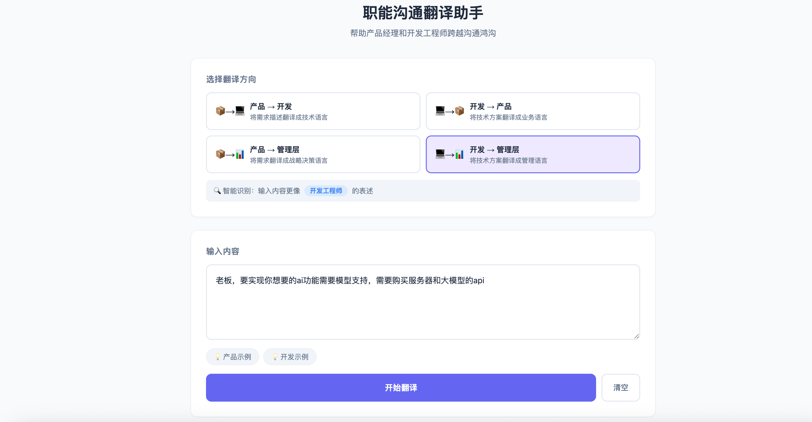
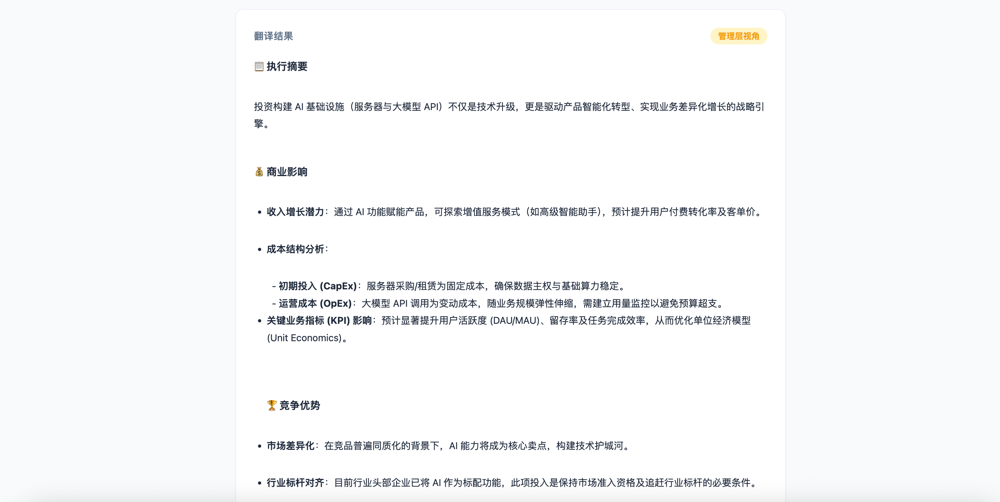

# 职能沟通翻译助手

帮助产品经理和开发工程师跨越沟通鸿沟的 AI 翻译工具。将产品需求翻译成技术语言，将技术方案翻译成业务语言。

> **在线演示**：[https://role-translator.onrender.com](https://role-translator.onrender.com)

## 项目预览

<!-- 部署完成后替换为实际截图 -->
<p align="center">
  
</p>

<p align="center">
  
</p>

## 功能特性

- **产品 → 开发**：将产品需求描述翻译成技术方案分析，包含技术选型建议、工作量评估、风险提示
- **开发 → 产品**：将技术方案翻译成业务影响分析，包含用户体验影响、业务价值、行动建议
- **产品 → 管理层**：将产品需求翻译成战略决策语言
- **开发 → 管理层**：将技术方案翻译成管理层能理解的战略分析
- **智能识别**：自动检测输入内容属于产品视角还是开发视角
- **流式输出**：实时展示 AI 生成过程，体验流畅

## 快速开始

### 1. 安装依赖

```bash
cd role-translator
pip install -r requirements.txt
```

### 2. 配置环境变量

复制 `.env.example` 并填入你的 API Key：

```bash
cp .env.example .env
```

```env
API_KEY=your_api_key_here
BASE_URL=https://coding.dashscope.aliyuncs.com/v1
MODEL=qwen3.5-plus
```

支持任何 OpenAI 兼容的 API（如 OpenAI、DeepSeek、智谱等），只需修改对应的 KEY 和 BASE_URL。

### 3. 运行项目

```bash
python app.py
```

打开浏览器访问 http://localhost:8000 即可使用。

## 在线部署（Render）

本项目已配置 `render.yaml`，可一键部署到 [Render](https://render.com)：

1. Fork 本仓库到你的 GitHub
2. 在 Render Dashboard 中选择 **New > Blueprint**，连接你的仓库
3. 在环境变量中配置 `API_KEY`、`BASE_URL`、`MODEL`
4. 等待构建完成即可访问

## 测试用例

### 用例 1：产品 → 开发

**输入（产品视角）：**

> 我们需要一个智能推荐功能，根据用户的浏览历史和购买记录，在首页展示个性化的商品推荐，目标是提升用户停留时长和转化率。希望第一期能在下个月上线。

**预期翻译效果（开发视角）：**

翻译结果会包含：
- 推荐算法类型建议（协同过滤、内容推荐、混合推荐等）
- 数据来源分析（用户行为日志、商品属性数据、订单数据）
- 性能要求（推荐接口响应时间、数据实时性要求）
- 开发任务拆解与工时评估
- 技术风险点和需要产品确认的问题

### 用例 2：开发 → 产品

**输入（开发视角）：**

> 我们对订单查询接口进行了重构，引入了 Redis 缓存层和读写分离架构，数据库查询 QPS 从 500 提升到了 2000，P99 延迟从 800ms 降低到了 120ms。同时优化了索引结构，存储空间减少了 40%。

**预期翻译效果（产品视角）：**

翻译结果会包含：
- 用户体验改善：订单页面加载速度大幅提升，用户等待时间缩短 85%
- 业务价值：系统能支撑 4 倍的用户访问量，为业务增长提供技术支撑
- 成本节省：服务器存储成本降低约 40%
- 产品侧行动建议：可以规划更复杂的订单查询功能

## 提示词设计说明

### 设计思路

核心挑战是让 AI 理解产品经理和开发工程师的**思维模式差异**：

| 维度 | 产品经理 | 开发工程师 |
|------|---------|-----------|
| 关注点 | 用户价值、商业目标 | 技术实现、性能指标 |
| 表达方式 | 功能描述、场景故事 | 技术术语、数据指标 |
| 评估标准 | 用户满意度、转化率 | 可行性、工作量、风险 |

### 关键设计点

1. **角色定位明确**：每个方向的 prompt 都明确定义了翻译专家的角色和目标受众
2. **结构化输出**：使用固定的输出格式模板，确保翻译结果覆盖关键维度
3. **主动补充机制**：要求 AI 识别输入中缺失的信息并主动补充
4. **翻译原则约束**：为每个方向设定具体的翻译原则，引导 AI 的翻译风格
5. **多角色支持**：除了产品和开发的双向翻译，还支持向管理层翻译，覆盖更多实际场景

## 技术架构

```
前端 (HTML/CSS/JS)  ←→  FastAPI 后端  ←→  阿里云通义千问 API
     │                      │
     │  SSE 流式输出         │  OpenAI 兼容接口
     │                      │
     └──────────────────────┘
```

- **后端**：Python + FastAPI，支持 SSE 流式响应
- **前端**：原生 HTML + CSS + JavaScript，无框架依赖
- **AI**：阿里云通义千问（通过 OpenAI 兼容接口调用）
- **部署**：Render（gunicorn + uvicorn worker）
